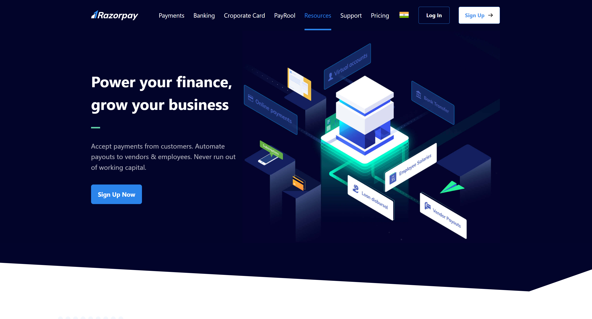
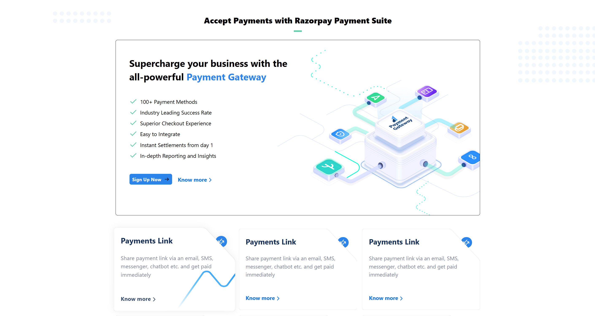
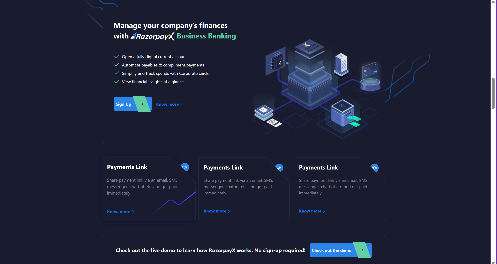

# Razorpay Landing Page Clone

## Overview
This project is a **clone** of the **Razorpay landing page**, built using **HTML** and **Tailwind CSS**. The goal of this project is to replicate the design of Razorpay's official website while improving web development skills.

## Preview
You can preview the live version of this project using:
[Live Preview](https://htmlpreview.github.io/?https://github.com/sourav4152/project_basic/blob/main/razor-pay/src/index.html)

## Features
- **Modern UI Components**
- **Tailwind CSS for Styling**
- **Optimized for Performance**

## Technologies Used
- **HTML**
- **Tailwind CSS**

## Installation and Setup
To run this project on your local machine, follow these steps:

1. **Clone the Repository**
   ```sh
   git clone https://github.com/your-username/razorpay-clone.git
   ```
2. **Navigate to Project Folder**
   ```sh
   cd razorpay-clone
   ```
3. **Open in Browser**
   Simply open the `index.html` file in your browser.

## Screenshots
Here are some screenshots of the Razorpay landing page clone:

### HERO SECTION


### FEATURE SECTION


### CORE FEATURES



## Contributing
If you would like to contribute to this project, feel free to fork the repository and submit a pull request.

## License
This project is for educational purposes and is not affiliated with Razorpay.

## Contact
For any queries, feel free to contact me at [your email] or connect with me on GitHub @sourav4152.

